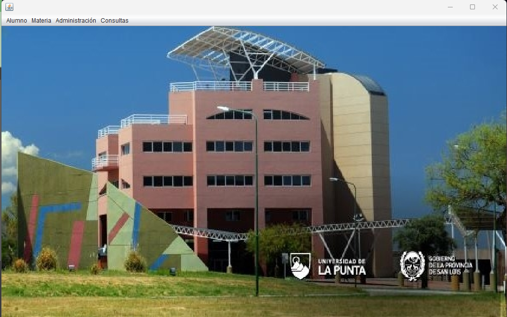
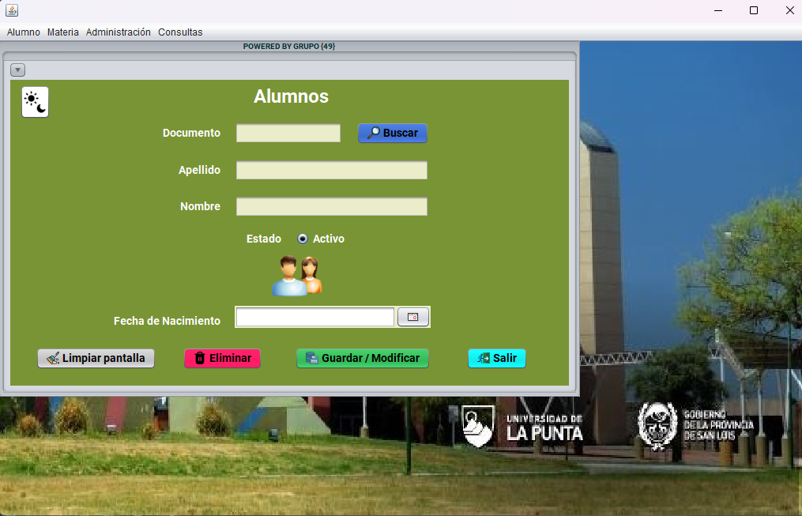
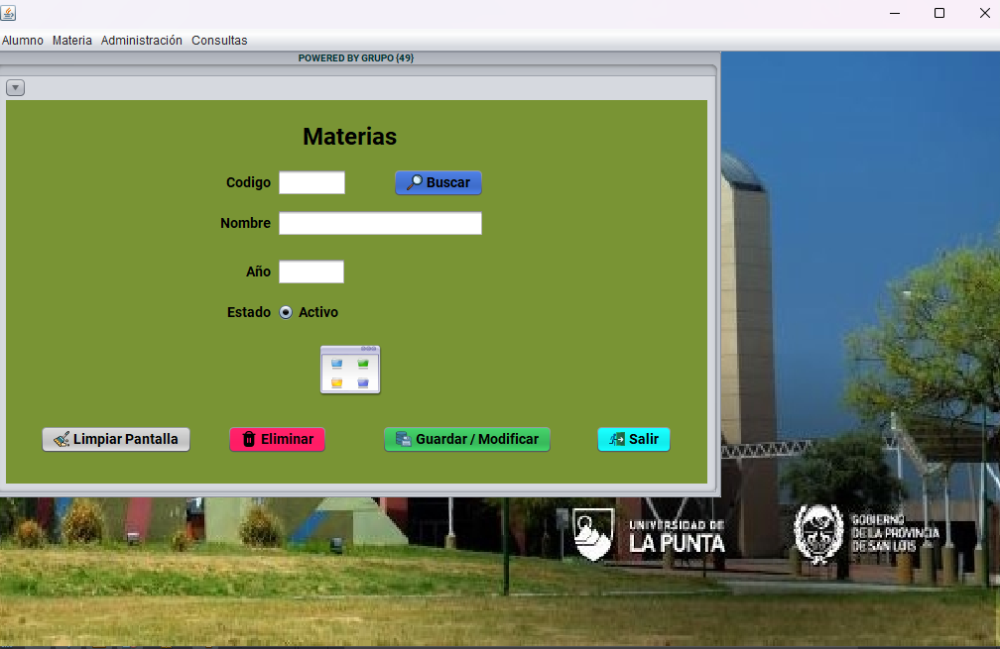
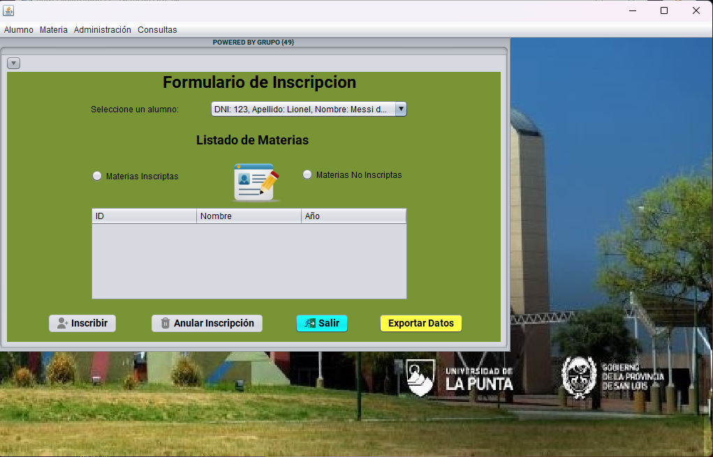
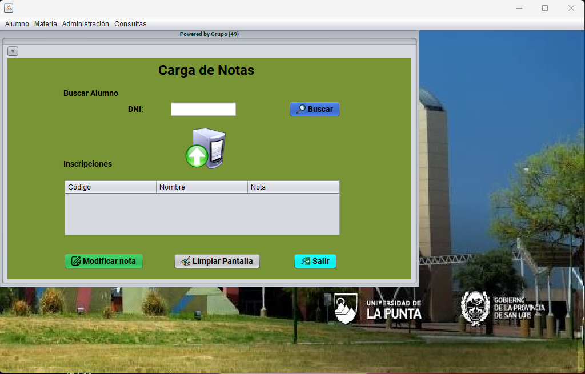
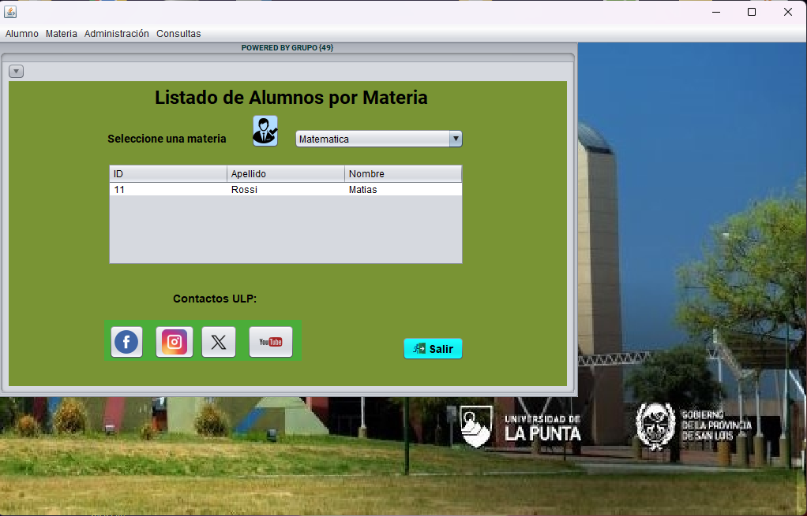

<h1 align="center">Hola 👋, somos los integrantes del grupo {49} de la ULP de San Luis Argentina<a href="https://github.com/GonzaloDelCastello/universidadgrupo49/README.md" >
</h1>

<h3 align="center">Apasionados FullStack developer</h3>
<h3 align="left">Herramientas utilizadas:</h3>

 

 

<a href="https://github.com/GonzaloDelCastello/universidadgrupo49/README.md" >

   
<a href="https://github.com/GonzaloDelCastello/universidadgrupo49/README.md" >

   
<a href="https://github.com/GonzaloDelCastello/universidadgrupo49/README.md" >

   
<a href="https://github.com/GonzaloDelCastello/universidadgrupo49/README.md" >

   
<a href="https://github.com/GonzaloDelCastello/universidadgrupo49/README.md" >

   
<a href="https://github.com/GonzaloDelCastello/universidadgrupo49/README.md" >

     

